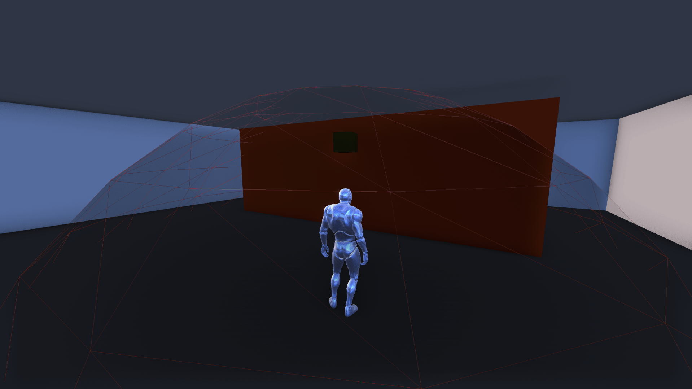
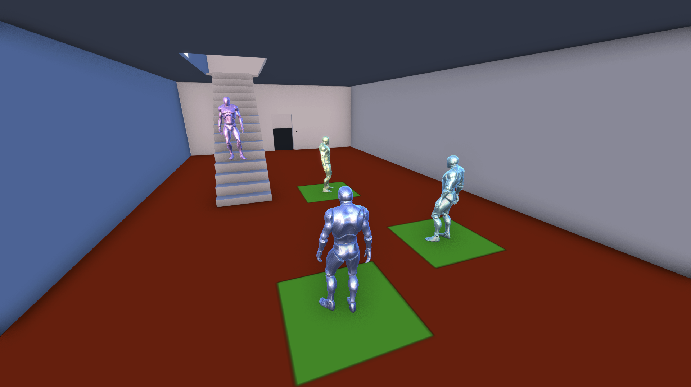
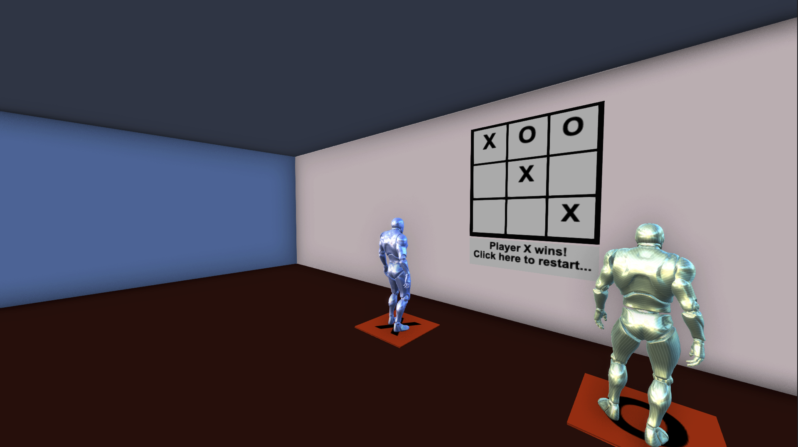

# MML React Space

The React Space is an ambitious project that merges the capabilities of Mixed Markup Language (MML) with the composability and dynamism of React. The aim is to provide an environment where developers can create interactive, immersive experiences with ease and speed.

Visualize building a structure. In this project, each component is like a 'room', built from 'walls' (elements). These rooms combine to form a 'floor' (a cohesive collection of related components). Leveraging the intuitive syntax of React, developers can swiftly prototype and convert their ideas into an engaging, tangible form.

Beneath the hood, The React Space taps into the power of React's hook system. It uses hooks such as useRef for accessing DOM elements, useState for state management, and useEffect for side effects like adding event listeners or fetching data.

While The React Space offers a suite of pre-configured components to jump-start your development, it's more than just a library. It's a starting point, an inspiration for creating your own unique components and experiences. Whether your goal is to construct a simple interactive widget or a complex immersive world, The React Space provides a robust, scalable foundation.

This project uses [MML](https://mml.io), the [MML Playground](https://github.com/mml-io/mml-playground/), and [React](https://react.dev/) to create a live-updating MML document. It can be easily deployed to environments that support Node.js and can expose ports to the internet. The React application resides in the `./packages/mml-document` folder.

## Running locally

Make sure you have Node.js installed. Run the following commands from the root of the repository:

```bash
npm install
npm run iterate
```

After the server is up and running, open `http://localhost:20205` in your browser.

## Apple Silicon Support

This repository uses [node-canvas](https://www.npmjs.com/package/canvas) which requires to be built from source. If you encounter issues running the project on Apple Silicon or other Arm64 platforms, ensure that you have [Homebrew](https://brew.sh/) installed and execute the following:

```bash
brew install pkg-config cairo pango libpng jpeg giflib librsvg pixman
```

Once all the packages are installed, you should be able to install the canvas package.

```bash
npm install canvas
```

Project Structure
The entry point of the React application is located at ./packages/mml-document/src, where you can find the index.tsx file.

The application is organized around the concept of "floors," essentially collections of "rooms." These floors are housed within the ./packages/mml-document/src/floors directory.

Each floor consists of various rooms, each of which you can find within the ./packages/mml-document/src/rooms directory. The x, y, and z props can be used to adjust the position of each floor and room within the 3D space, allowing for a highly customizable layout.

In the ./packages/mml-document/src/components directory, you can find a variety of structural components, furniture, and other items used to assemble the rooms.

## Experiences

### Wall Probe



The Wall Probe (`./packages/mml-document/src/components/experiences/WallProbe.tsx`) is a versatile component that leverages the m-position-probe element of MML. It is designed to detect the user's position in the virtual environment, allowing for a high degree of interactivity.

When a user is in proximity, a cube manifests above the player and shadows their movements, effectively indicating their 'presence' within the virtual space. For debugging and development purposes, you can display the probe area by setting debug="true" on the component.

This component can be especially useful in creating interactive experiences, such as games, virtual tours, or any 3D environment where user interaction plays a pivotal role.

### Disco Floor



The Disco Floor utilizes a cube with collision detection. When a user collides with the cube, their location is tracked. The collision events trigger the creation of a 2D canvas where a rectangle is drawn at the corresponding user's position, effectively mirroring their movement on the 'floor'. The color of the floor also changes every 500ms, giving it a 'disco' effect.

It's an excellent demonstration of how collision events can be utilized to provide visual feedback based on user interaction.

### Tic Tac Toe



This component demonstrates the use of collision events on a cube and a canvas to draw a tic tac toe game on the floor. It also uses colliders on the floor for players to join or leave the game.