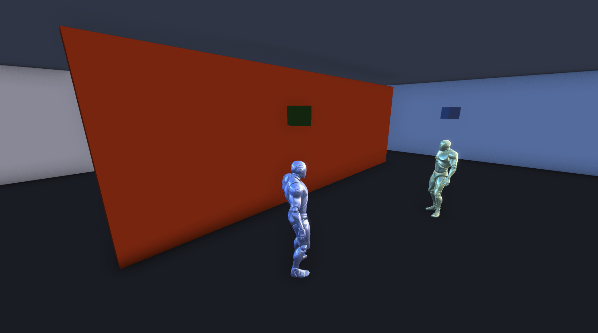

# MML React Space


This project uses [MML](https://mml.io), [MML 3D Web Experience](https://github.com/mml-io/3d-web-experience/), and [React](https://react.dev/) to create an **interactive, multi-user 3D web experience** based on an MML document created using standard React code and patterns.

It can be easily deployed to environments that support Node.js and can expose ports to the internet. 

The React application can be found in the [`./packages/mml-document/src`](./packages/mml-document/src) folder.

### React + MML

[React](https://react.dev) is designed to make it easier to build complex, interactive UIs by breaking them down into smaller, reusable components. As MML is valid HTML, React can be used to describe the HTML document that runs inside a NetworkedDOM server, and by running this document on a server that accepts WebSockets, you can have multiple users connect to the same single instance of the React document which can use all of the familiar React capabilities, but have it be synchronized to multiple users.

You can use React hooks, add event listeners, create reusable components, and also include external libraries (as `react` itself is just a dependency) to build multi-user, interactive 3D experiences in a way that feels as familiar and as effective as building web pages with modern tooling.

### Project Concepts

The [React/MML document in this repository](./packages/mml-document/src) is laid out as a building modelled after a museum with multiple floors, rooms, and componentized interactive experiences.

This serves as a jumping off point to reuse the building layout, components, patterns, or simply just the configuration of the project as having a single React-defined experience.


## Running locally

Make sure you have Node.js installed. Run the following commands from the root of the repository:

```bash
npm install
npm run iterate
```

After the server is up and running, open `http://localhost:8080` in your browser.

## Apple Silicon Support

This repository uses [node-canvas](https://www.npmjs.com/package/canvas) which requires being built from source on Apple Silicon. If you encounter issues running the project on Apple Silicon or other Arm64 platforms, ensure that you have [Homebrew](https://brew.sh/) installed and execute the following:

```bash
brew install pkg-config cairo pango libpng jpeg giflib librsvg pixman
```

Once all the packages are installed, you should be able to install the canvas package.

```bash
npm install canvas
```

## Project Structure
The entry point of the React application is located at [`./packages/mml-document/src`](./packages/mml-document/src), where you can find the [index.tsx](./packages/mml-document/src/index.tsx) file.

The application is organized around the concept of "floors," essentially collections of "rooms." These floors are housed within the [./packages/mml-document/src/floors](./packages/mml-document/src/floors) directory.

Each floor consists of various rooms, each of which you can find within the [`./packages/mml-document/src/rooms`](./packages/mml-document/src/rooms). The `x`, `y`, and `z` props can be used to adjust the position of each floor and room within the 3D space, allowing for a highly customizable layout.

In the [`./packages/mml-document/src/components`](./packages/mml-document/src/components) directory, you can find a variety of structural components, furniture, and other items used to assemble rooms.

## Experiences

Here are some of the experiences that are included in this project that you can use as a starting point for your own projects.

### Wall Probe



The Wall Probe ([`./packages/mml-document/src/components/experiences/WallProbe.tsx`](./packages/mml-document/src/components/experiences/WallProbe.tsx)) is a component that uses the [`m-position-probe`](https://mml.io/docs/reference/elements/m-position-probe) element of MML. It is designed to detect the user's position in the virtual environment, allowing for a high degree of interactivity.

When a user is in proximity, a cube is created above the user and shadows their movements, effectively acknowledging their 'presence' within the virtual space. For debugging and development purposes, you can display the probe area by setting `debug="true"` on the [`m-position-probe`](https://mml.io/docs/reference/elements/m-position-probe) component.

This component can be especially useful in creating interactive experiences, such as games, virtual tours, or any 3D environment where user presence plays a role.

### Disco Floor


The Disco Floor ([`./packages/mml-document/src/components/experiences/DiscoFloor.tsx`](./packages/mml-document/src/components/experiences/DiscoFloor.tsx)) uses a cube with collision detection. When a user collides with the cube, the position of the collision is tracked. The collision events trigger the drawing of a 2D canvas where a rectangle is drawn corresponding to a user's position, effectively mirroring their movement on the floor. The color of the floor also changes every 500ms.

It's a demonstration of how collision events can be used to react to user interaction.

### Tic Tac Toe


The Tic Tac Toe ([`./packages/mml-document/src/components/experiences/TicTacToe.tsx`](./packages/mml-document/src/components/experiences/TicTacToe.tsx)) component demonstrates the use of collision events on a cube and a canvas to draw a tic tac toe game on the wall. It also uses colliders on the floor for detecting users joining or leaving the game.
